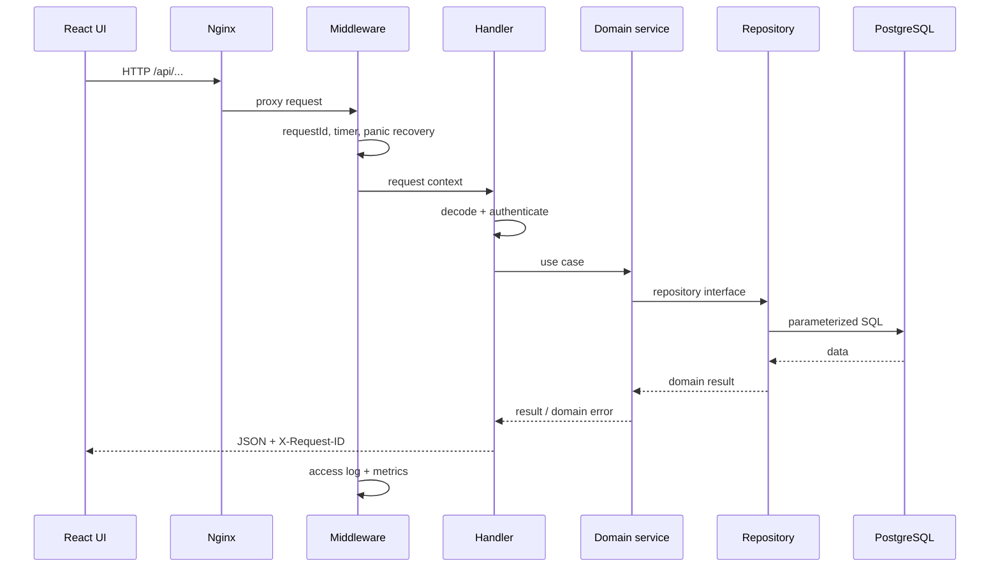
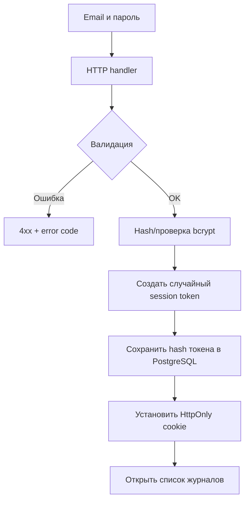
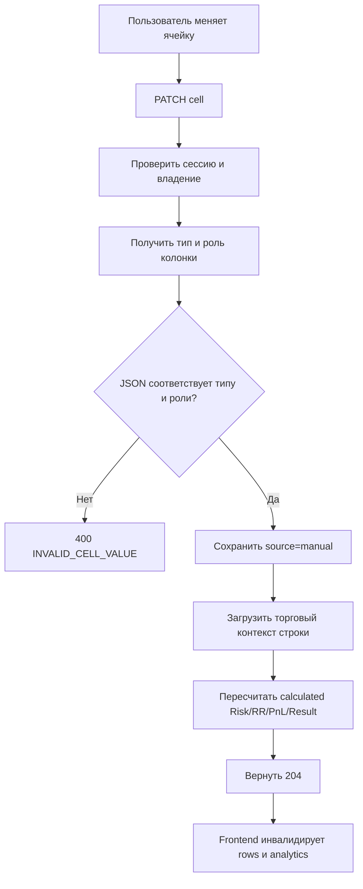
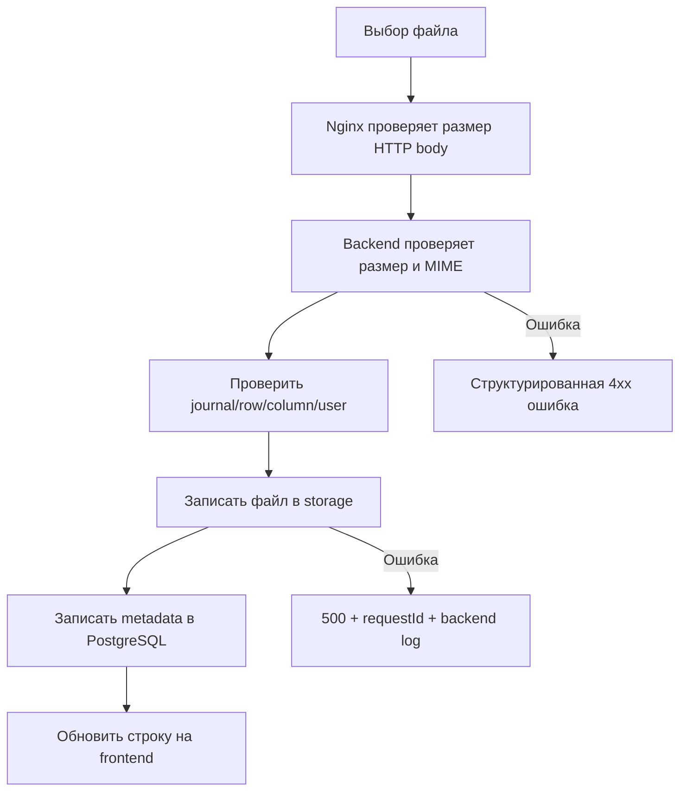
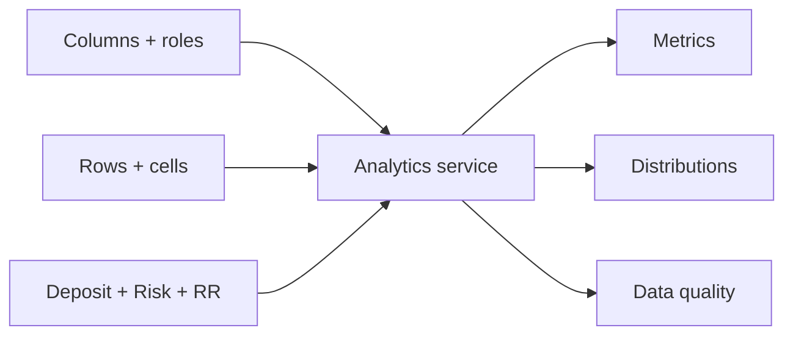

# Потоки приложения

## Жизненный цикл запроса

## Регистрация и вход

## Изменение ячейки

Подробные формулы описаны в [правилах торговых расчётов](trading-calculation-rules.md).

## Изменение схемы журнала

Создание, изменение роли или удаление колонки меняет смысл существующих строк. После операции backend запускает пересчёт всех строк журнала. Frontend обновляет columns, rows и analytics.

## Загрузка изображения

Порядок записи файла и metadata требует компенсации при частичном сбое: незавершённая операция не должна оставлять недоступный metadata record или бесхозный файл.

## Аналитика

`GET /journals/{id}/analytics` загружает согласованный dataset: системные колонки, строки, значения и настройки. Domain-сервис вычисляет метрики и data-quality issues, после чего frontend только форматирует отчёт.

