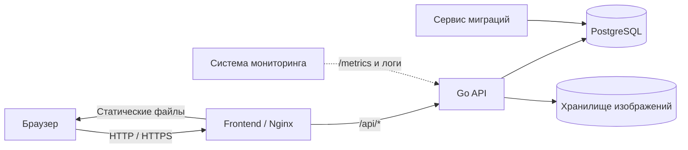
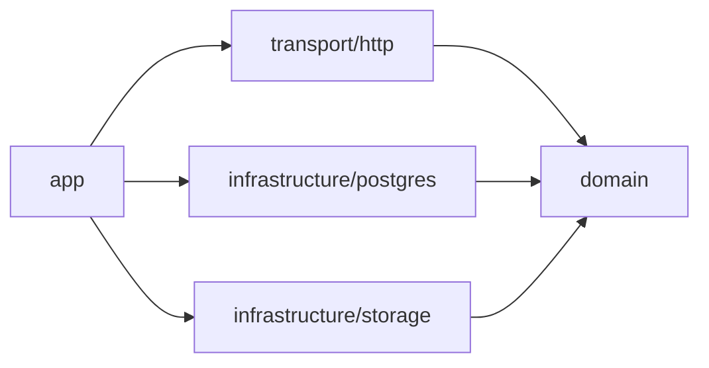

# Обзор архитектуры

## Назначение системы

Trade Diary — многопользовательское веб-приложение для гибких торговых журналов. Пользователь сам задаёт структуру таблицы, а системные роли колонок подключают расчёты и аналитику.

## Компоненты

| Компонент | Ответственность |
|---|---|
| React frontend | Интерфейс, маршрутизация, серверное и локальное состояние, уведомления |
| Nginx | Раздача собранного frontend и проксирование `/api` в backend |
| Go backend | Авторизация, бизнес-правила, валидация, расчёты и HTTP API |
| PostgreSQL | Пользователи, сессии, журналы, колонки, строки, ячейки и метаданные файлов |
| File storage | Содержимое загруженных изображений |
| Migrate | Последовательное применение версий схемы и data migrations |

## Архитектурные границы

- Frontend не рассчитывает доверенные торговые значения и не обращается к базе напрямую.
- HTTP-обработчики преобразуют запросы и ответы, но не содержат бизнес-правил.
- Domain-сервисы не знают о PostgreSQL, mux, cookies или файловой системе.
- Infrastructure реализует интерфейсы domain и отвечает за внешние технологии.
- PostgreSQL хранит гибкие значения ячеек как `jsonb`, а backend валидирует их по типу колонки.

## Направление зависимостей

Domain расположен в центре. Пакет `app` является composition root: создаёт подключения, репозитории, сервисы и HTTP-сервер.

## Сквозные требования

- Каждый ресурс проверяется на принадлежность текущему пользователю.
- Ошибки API имеют стабильный код и `requestId`.
- Ручные значения не перезаписываются автоматическими расчётами.
- Изменения схемы выполняются только миграциями.
- Значимое поведение покрывается тестами на наиболее близком к нему уровне.
