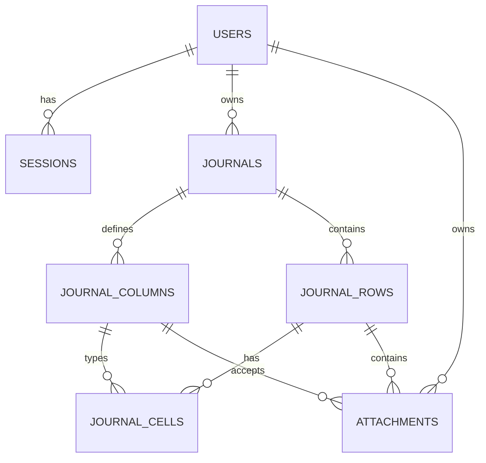

# Модель данных

## Связи

## Основные таблицы

| Таблица | Назначение |
|---|---|
| `users` | Учётные записи и password hash |
| `sessions` | Hash токена сессии и срок действия |
| `journals` | Журнал, владелец, депозит, Risk и RR по умолчанию |
| `journal_columns` | Пользовательская схема таблицы, тип, роль и позиция |
| `journal_rows` | Строки журнала и их порядок |
| `journal_cells` | Значение `jsonb` на пересечении строки и колонки |
| `attachments` | Метаданные изображения и ключ файлового хранилища |

## Динамические ячейки

`journal_cells.value` имеет тип `jsonb`, потому что колонки создаются пользователем. Допустимая JSON-форма определяется `journal_columns.type`:

| Тип колонки | JSON-значение |
|---|---|
| `text` | строка |
| `number` | число |
| `select` | строка из `options` |
| `date` | строка `YYYY-MM-DD` с реальной календарной датой |
| `boolean` | `true` или `false` |
| `image` | значение обслуживается attachment-процессом |

Backend выполняет строгую проверку перед записью. PostgreSQL обеспечивает связи и целостность владения через составные foreign keys.

## Источник значения

Поле `journal_cells.source`:

- `manual` — введено пользователем;
- `calculated` — вычислено backend;
- `default` — создано как исходное значение.

Автопересчёт может заменять только расчётные значения. Ручное значение сохраняется и при противоречии получает data-quality warning.

## Удаление

Связанные данные удаляются каскадно от пользователя или журнала. Физический файл требует отдельного удаления через storage, поэтому операции с attachments должны учитывать согласованность БД и файловой системы.

## Миграции

Файлы в `backend/migrations` неизменяемы после применения. Новое изменение получает следующий номер и пары `up/down`. Исправление данных оформляется data migration, а не ручным SQL на конкретном окружении.
