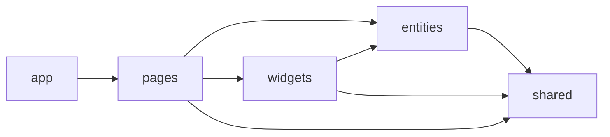

# Архитектура frontend

## Стек

- React и TypeScript;
- React Router для маршрутов;
- TanStack Query для серверного состояния;
- Zustand для локального глобального состояния;
- Vite для разработки и production build;
- Lucide для интерфейсных иконок.

## Слои

```text
frontend/src/
├── app/         запуск, providers, router и глобальные стили
├── pages/       страницы маршрутов
├── widgets/     крупные самостоятельные части страниц
├── entities/    API и типы бизнес-сущностей
└── shared/      HTTP-клиент, конфигурация и общие store
```

Это практическая FSD-структура текущего масштаба. Новые слои `features` или `shared/ui` добавляются, когда появляется реальное повторное использование, а не заранее.

## Направление импортов



Нижний слой не импортирует верхний: `shared` не знает об entities/pages, а entity не зависит от страницы.

## Состояние

| Вид состояния | Инструмент | Примеры |
|---|---|---|
| Серверное | TanStack Query | пользователь, журналы, колонки, строки, аналитика |
| Глобальное UI | Zustand | уведомления, состояние общей оболочки |
| Локальное UI | React state | диалоги, активная вкладка, закреплённое изображение |
| Навигация | React Router | `/`, `/login`, `/register`, `/journals/:id` |

После mutation инвалидируются только затронутые query keys. Backend остаётся источником истины для расчётных значений.

## HTTP-клиент

`shared/api/http.ts` добавляет базовый URL и `credentials: include`, разбирает единый формат ошибок и возвращает типизированный JSON. Entity API описывает URL и DTO, но не отображение.

## UI-правила

- Страница выполняет пользовательский процесс, widget решает крупную часть процесса, entity предоставляет данные.
- Ошибка mutation должна быть видна пользователю и при наличии показывать `requestId`.
- Расчётное значение отображается из ответа backend, а не дублируется отдельной формулой на клиенте.
- Диалоги и таблица сохраняют клавиатурную доступность и не меняют размеры из-за динамического содержимого.
