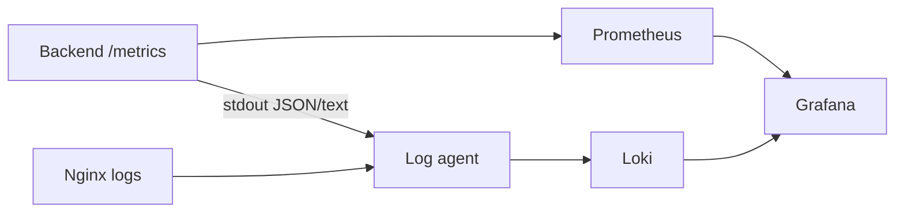

# Наблюдаемость и эксплуатация

## Что доступно сейчас

| Сигнал | Реализация | Где смотреть |
|---|---|---|
| Application logs | Структурированные записи Go `slog` | stdout backend-контейнера |
| Access logs | method, path, status, duration, bytes, request ID | stdout backend-контейнера |
| Error logs | operation, internal error и business identifiers | stdout backend-контейнера |
| Request correlation | `X-Request-ID` в запросе/ответе и `requestId` в ошибке | UI, Network, backend logs |
| Health | `GET /health` | Docker healthcheck и мониторинг |
| Metrics | Prometheus text format на `GET /metrics` | браузер/curl, далее Prometheus |

Текущие метрики находятся в памяти процесса: количество запросов, 5xx, panic, активные запросы и суммарная длительность.

## Поиск ошибки пользователя

1. Получить `requestId` из уведомления frontend или ответа в DevTools Network.
2. Найти backend log с полем `request_id`.
3. Проверить `method`, `path`, `status`, `duration` и запись `request failed`.
4. По `operation` определить handler/use case, где произошла ошибка.
5. Сопоставить время с логами PostgreSQL, Nginx или storage, если сбой внешний.

`500` намеренно не раскрывает детали клиенту. Полная причина должна быть в backend log с тем же request ID.

## Граница Nginx и backend

Ошибка может возникнуть до Go API. Например, Nginx возвращает `413`, если HTTP body превышает `client_max_body_size`; backend в таком случае не получает запрос и не создаёт свой access log. Диагностика всегда начинается с определения компонента, сформировавшего ответ.

## Prometheus, Loki и Grafana

- Prometheus периодически собирает числовые метрики.
- Loki хранит и индексирует логи по labels.
- Grafana показывает dashboards и позволяет переходить от всплеска 5xx к логам.
- Alertmanager добавляется для уведомлений о недоступности, росте ошибок и latency.

Подключение этих сервисов — следующий инфраструктурный этап; текущий `/metrics` является минимальной точкой интеграции, но ещё не заменяет production monitoring.

## Минимальные production alerts

- backend или frontend healthcheck недоступен;
- доля 5xx превышает порог;
- p95 latency растёт;
- PostgreSQL недоступен или заканчиваются соединения;
- заканчивается место в PostgreSQL/storage;
- миграция завершилась ошибкой или схема находится в dirty-state;
- растёт количество panic.

## Миграции и запуск

В Compose сервис `migrate` ждёт healthy PostgreSQL и применяет миграции до старта backend. Backend запускается только после успешного завершения миграций. Frontend, в свою очередь, ждёт healthy backend.

## Резервное копирование

Для восстановления нужны согласованные копии PostgreSQL и volume изображений. Резервная копия только базы сохранит metadata, но не содержимое скриншотов; копия только storage потеряет связи и владельцев.
