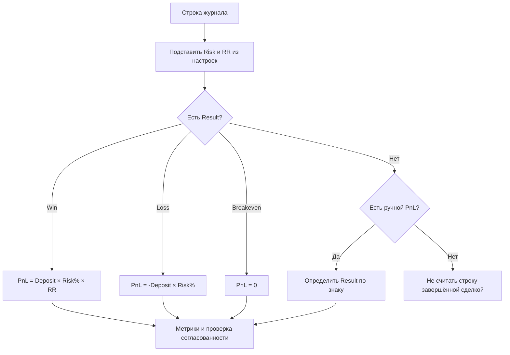

# Правила торговых расчётов

## Модель сделки

Для автоматических расчётов используются системные роли колонок:

| Роль | Тип | Значение |
|---|---|---|
| `trade_result` | `select` | `Win`, `Loss` или `Breakeven` |
| `pnl` | `number` | Денежный результат сделки |
| `r` | `number` | Положительное RR (Risk/Reward): `3` означает `1 : 3` |
| `risk` | `number` | Риск сделки в процентах от начального депозита |

Настройки нового журнала:

| Поле | Значение по умолчанию |
|---|---:|
| Начальный депозит | 10 000 |
| Риск на сделку | 1% |
| RR | 1 : 2 |

Risk и RR в строке могут переопределять настройки журнала. Оба значения должны быть положительными, Risk не может превышать 100%.

## Автозаполнение

При создании или пересчёте строки пустые системные колонки получают Risk и RR из настроек журнала. Новая строка также получает локальную текущую дату во всех колонках типа `date`.

Выбор результата сделки запускает расчёт PnL:

```text
riskAmount = initialDeposit × riskPercent / 100

Win       → PnL = riskAmount × RR
Loss      → PnL = -riskAmount
Breakeven → PnL = 0
```

При RR `1 : 3` выигрыш равен `+3R`, а убыток всегда равен `-1R`. Пользователь не вводит отрицательный RR.

Ручной PnL не перезаписывается. Если Result отсутствует, знак ручного PnL может заполнить Result автоматически. Изменение настроек, ролей колонок, Result, Risk или RR пересчитывает зависимые расчётные значения.

Ячейка хранит источник значения:

```text
manual      — введено пользователем
calculated  — рассчитано системой или взято из настроек
default     — значение по умолчанию
```

## Достаточный набор

Для полного автоматического расчёта достаточно Result. Deposit, Risk и RR уже заданы настройками журнала. Индивидуальные Risk и RR нужны только для переопределения конкретной сделки.

| Введено пользователем | Автоматический результат |
|---|---|
| Result | Risk, RR, PnL и основные метрики |
| Result + Risk | PnL с индивидуальным процентом риска |
| Result + RR | PnL с индивидуальным Risk/Reward |
| PnL | Result по знаку и денежные метрики |

## Аналитика

Фактический результат сделки в R:

```text
Win       → +RR
Loss      → -1R
Breakeven → 0R
```

```text
Winrate = Wins / (Wins + Losses) × 100
Total PnL = сумма PnL
Average PnL = Total PnL / количество сделок с PnL
Profit Factor = сумма положительных PnL / абсолютная сумма отрицательных PnL
Total R = сумма фактических результатов в R
Average R = Total R / количество сделок с результатом
```

Breakeven не входит в знаменатель Winrate. Profit Factor недоступен, пока нет отрицательного PnL.

## Согласованность

Строка получает ненавязчивое предупреждение, если Result противоречит знаку ручного PnL, ручной PnL не совпадает с расчётом Result/Risk/RR либо Risk/RR находятся вне допустимого диапазона. Ручные значения не удаляются автоматически.

## Поток расчёта



## Ограничение

Риск рассчитывается от начального депозита, а не от динамического баланса. Расчёт от текущего баланса потребует хронологии, комиссий, пополнений и выводов и будет отдельным режимом.
